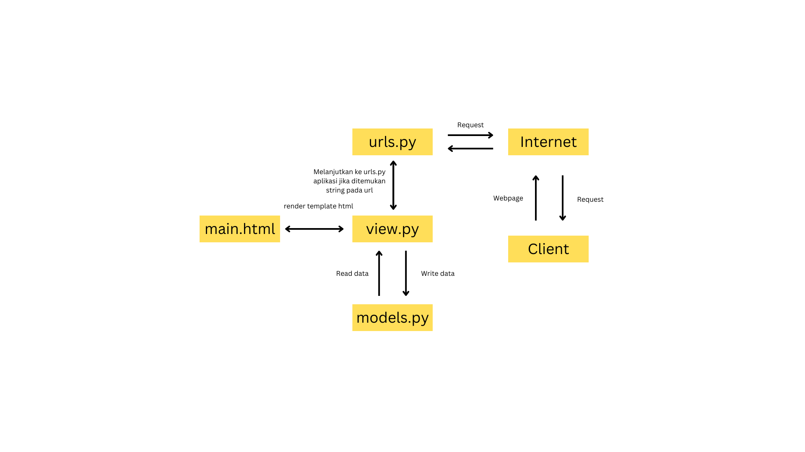
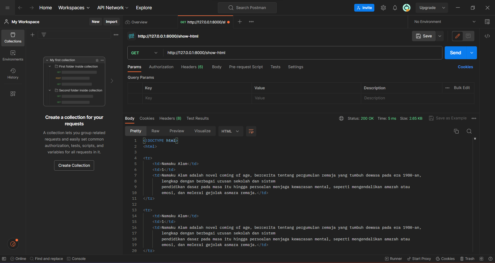
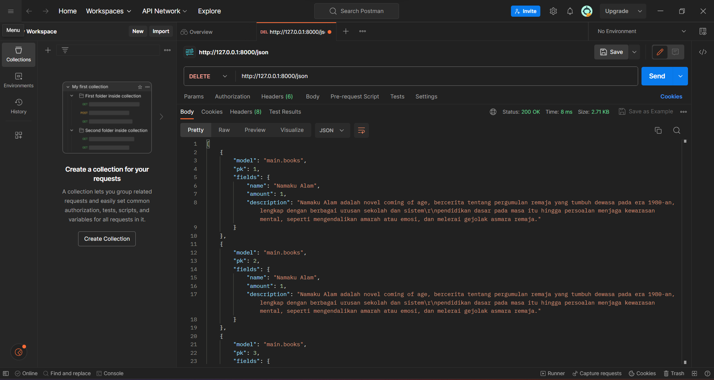
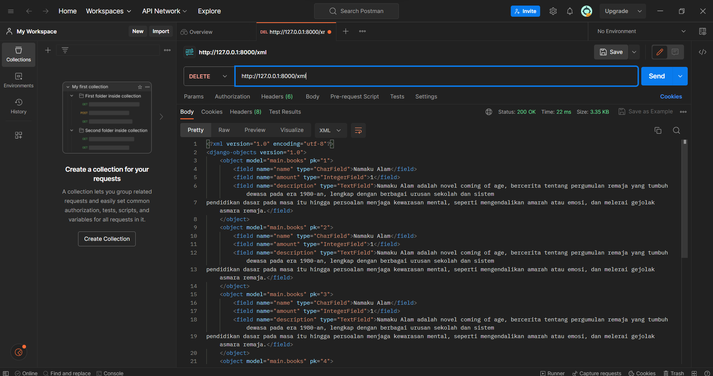
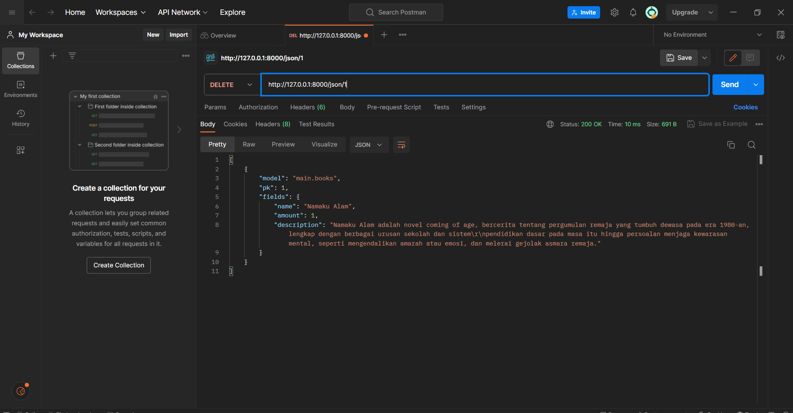
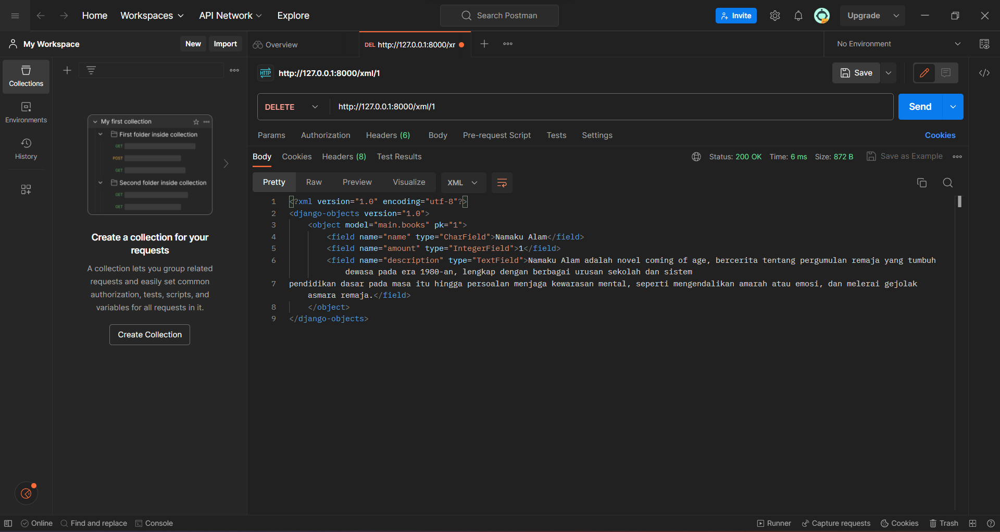

# Tugas 2

1. 
- Pertama, saya mengaktifkan _virtual environment_ dengan cara melakukan `python -m venv env`. Setelah itu saya menyiapkan sebuah berkas `requirements.txt` dan menambahkan _dependancies_ yang saya perlukan untuk project ini. Kemudian pada _virtual environment_, saya menjalankan perintah `pip install -r requirements` untuk menginstall _dependencies_ tersebut. Lalu, saya membuat project django baru bernama `PinjamBuku`. Tidak lupa, saya juga mengubah `ALLOWED_HOST` pada `settings.py` supaya menjadi `*` untuk mengizinkan akses dari semua `host`.
- Setelah itu, saya membuat aplikasi `main` pada proyek ini dan kemudian aplikasi tersebut ditambakan ke `settings.py` pada proyek saya. Kemudian, pada `main` saya melakukan konfigurasi routing URL aplikasi main. Hal ini dilakukan dengan cara mengedit `urls.py`. Hal ini dilakukan agar kita dapat melakukan `.../main` untuk pergi ke aplikasi ini. Tidak lupa, saya juka mengedit `urls.py` pada tingkat proyek untuk mengecek jika ada substring yang bisa diarahkan ke aplikasi kita. Dengan begitu, dapat dilakukan routing ketika kita menambahkan string pada pencarian.
- Setelah itu, dibuat model (kumpulan data) yang terdiri dari 3 atribut yaitu _name, amount,_ dan _description_. Kemudian, dibuatlah `views.py` yang merupakan sebuah fungsi yang mengambil _web request_ dan mengembalikan _web response_. Dalam kasus ini, yang dikembalikan adalah `main.html`. Perhatikan juga bahwa pada `urls.py` digunakan untuk memetakan `views.py`.
2. 
3. Kita menggunakan _virtual environment_ untuk mempermudah urusan _dependencies_ pada proyek kita. Selain itu, kita juga melakukan _environment_ yang terisolasi yang membuat kita lebih aman untuk mengembangkan proyek kita. _Virtual environment_ sebenarnya bisa saja tidak digunakan ketika kita ingin membuat sebuah proyek django, tetapi, _dependency_ yang kita lakukan bisa saja bertabrakan. Oleh karena itu, sebaiknya kita menggunakan _virtual environment_
4. 
- MVC (model-view-controller):
* Model: Logika dan data
* View: Tampilan aplikasi
* Controller: Request, manipulasi data, dan mengatur tampilan view
- MVT (model-view-template):
* Model: Logika dan data
* View: Tampilan aplikasi
* Template: Memisahkan logika tampilan dari kode Python (Perhatikan bahwa kita menggunakan html disini)
- MVVM (Model-View-ViewModel):
* Model: Logika dan data
* View: Tampilan aplikasi
* ViewModel: Konversi data dari model ke format yang diinginkan pada view

Perbedaan terletak pada controller, template, dan ViewModel. MVC fokus pada kontrol aliran aplikasi, MVT menggunakan template, dan MVVM menggunakan ViewModel sebagai perantara view dan model.

# Tugas 3
1. `POST` digunakan untuk mengirim data ((_file, form data,_ dsb) kepada server. Jika berhasil, akan dikembalikan HTTP _status code_ 201. Pada lain sisi, `GET` digunakan untuk mendapatkan (membaca) data. Jika berhasil, akan dikembalikan HTTP _status code_ 200 (OK).
2. `HTML` adalah _markup language_ untuk dokumen yang didesain agar dapat muncul pada _web browser_. Pada lain sisi, terdapat `JSON` dan `XML` yang secara umum digunakan untuk penyimpanan dan pertukaran data. Hal yang membedakannya adalah `XML` menggunakan _XML DOM_ untuk melakukan _looping_ pada keseluruhan dokumen kemudian _value_ diambil dan disimpan pada variabel. Sedangkan `JSON` mengambil _JSON string_ yang perlu di-_parse_.
3. Sederhananya, `JSON` lebih mudah di-_parsing_ daripada `XML`. Untuk contoh kasarnya, perhatikan saja contoh `JSOn` dan `XML`, terlihat bahwa `JSON` lebih pendek.
4. Membuat `forms.py` dan menambahkan beberapa fungsi pada `views.py` untuk dapat mengirimkan data dan mendapatkan data. Pada dasarnya, kita membuat `forms.py` untuk menyimpan data ke _form_. Disana, terdapat beberapa hal yang disimpan dalam form, yaitu _name, amount,_ dan _description_. Setelah itu, dibuatlah fungsi `create_book` pada `views.py` yang salah satunya `create_book.html`. Fungsi ini digunakan untuk pergi ke `create_book.html` jika tombol `Add New Book` ditekan yang akan mengaktifkan fungsi `create_book`. Perhatikan juga bahwa dilakukan validasi terhadap form dan _redirect_ setelah data form berhasil disimpan. Kemudian, kita akan membuat fungsi show xml dan json, kemudian show xml dan json by id. Keempat fungsi ini kita buat pada `views.py` dan melakukan return data spesifik yang ingin kita return, entah itu `all` maupun berdasarkan `id`. Tidak lupa, kita menambahkan kode pada `urls.py` untuk dapat melihat hal-hal yang kita ingin lihat jika kita memasukkan url tersebut.
5. Gambar:
Gambar view html

Gambar view JSON

Gambar view XML

Gambar view JSON by id

Gambar view XML by id


# Tugas 4
1. `UserCreationForm` adalah modul yang memudahkan kita dalam membuat formulir karena dengan adanya modul tersebut kita tidak perlu menulis ulang kode dari awal (Ingat `Don't Repeat Yourself`). Kekurangan dari `UserCreationForm` adalah Kustomisasi yang terbatas. Jadi, sulit untuk kita membuat kustomisasi yang sesuai dengan keinginan dan kasus kita yang spesifik.

2. Autentikasi berfungsi untuk mengecek apakah pengguna tersebut benar-benar pengguna tersebut. Hal ini dicek dengan cara pengecekan kredensial pengguna dengan yang dimasukkan. Sedangkan, otorisasi mengatur hak akses dan izin pengguna. Hak akses dan izin ini contohnya seperti membaca, menulis, atau menghapus data. Selain itu, contohnya adalah bisa tidaknya seseorang masuk ke dalam suatu laman tertentu. 

Keduanya penting karena pertama, kita harus memastikan apakah seseorang benar merupakan orang tersebut dan akses apa yang dia miliki. Hal ini akan sangat berpengaruh terhadap keamanan. Selain itu, privasi pengguna juga dapat dipengaruhi oleh kedua hal tersebut.

3. `Cookies` menyimpan informasi di browser `client`. Tujuan penggunaannya adalah untuk autentikasi, _user tracking, dan menyimpan preferensi user. Pada Django, Cookies menggunakan dictionary. Untuk mengelola data sesi pengguna, ketika login, kita akan melakukan `set_cookie` untuk melakukan set pada cookie. Lalu, ketika pengguna ingin logout, digunakanlah `delete_cookie` supaya terhapus.

4. Ada beberapa mitos tentang cookies yang perlu kita perhatikan. Mitos pertama adalah cookies bisa menghapus data. Pernyataan itu sebenarnya benar tapi _misleading_. Sebenarnya, cookies hanya dapat menghapus data, bukan potongan kode program. Data yang dihapus juga merupakan data yang hanya ingin diubah cookies saja, bukan data-data lain yang berada pada komputer kita. Mitos lain yang perlu diperhatikan juga adalah cookies adalah spyware. Ini salah karena cookies tidak bisa menghapus atau membaca informasi dari komputer user. Yang perlu diwaspadai adalah Cookie/Session Poisoning, dimana tujuannya adalah untuk  memodifikasi data cookies/session untuk mengubah autorisasi yang didapatkan.

5. Pertama, saya melakukan import untuk segala hal yang saya ingin lakukan. Pada views yang terletak pada main, saya membuat fungsi register, login, dan logout. Tujuan dari fungsi-fungsi tersebut sama dengan namanya. Kemudian, jika register dan login terpilih, maka mereka akan menampilkan html register maupun login. Jika logout yang dipilih maka logout terjadi dan session cookies akan dihapus. Kemudian, saya menambahkan ```@login_required(login_url='/login')``` supaya halaman login halaman main hanya dapat dimasuki oleh orang yang memiliki akun. Terakhir, saya menyambungkan Model `Books` dengan user. Hal ini perlu dilakukan agar yang muncul adalah buku spesifik milik orang yang spesifik. 

# Tugas 5
1. Selector elemen, selector id, selector class. Selector elemen mengubah semua tag yang sama. Selector by id mengumbah hanya salah satu elemen spesifik. Selector class memungkinkan kita untuk mengubah _stlyle_ elemen yang berada di sebuah class tertentu.

2. Head bergungsi untuk memberikan informasi website seperti judul, style, maupun metadatanya (walaupun metadatanya bisa berasal dari extend dari html lain). Selain itu ada body. Body dapat memiliki beberapa elemen yaitu h1, h2, h3, h4, h5 , dan h6 yaitu heading dengan berbagai ukuran. Selain itu ada juga tag p, a, input, dan form. P berarti paragraph, a untuk menampilkan link, input dan form sesuai namanya, yaitu untuk mengatur segala hal yang berhubungan dengan input dan form.

3. Margin adalah daerah diluar border yang dikosongkan. Padding merupakan daerah yang diisi oleh elemen yang kita miliki.

4. Tailwind memberikan kelas yang dapat kita gunakan untuk membuat komponen yang kita inginkan. Tailwind adalah kelas utilitas. Kelas-kelas tersebut dapat digunakan untuk membuat desain yang sesuai dengan kebutuhan. Di lain sisi, boostrap memiliki gaya yang sudah dapat langsung kita gunakan. Kita bisa langsung menggunakannya dengan mengetik bagaimana kita ingin elemen tersebut tampil. Kita dapat membaca dokumentasinya dan mengimplementasikannya. Kemudian, ini langsung bisa tampil.

5. Pada dasarnya saya membuat fungsi baru pada views yaitu delete dan edit. Kemudian supaya dia bisa ada, saya menambahkannya pada url. Lalu, saya menghias html yang saya miliki. Saya menggunakan boostrap maupun css untuk menghias tampilan laman saya. 

# Tugas 6
1. Asynchronus programming berarti proses berjalannya program bisa berlangsung bersamaan. Sedangkan, synchronous programming berarti suatu perintah yang perlu menunggu proses lain selesai terlebih dahulu
2. Alur eksekusi program perlu menunggu suatu _event_ untuk dapat terjadi. Event ini kemudian memicu respons yang perlu kita buat program kita untuk melakukan suatu hal yang kita inginkan jika suatu _event_ terjadi.
3. Kita perlu membuat _event handler_ yang menangani _event_ yang dibuat user. Kemudian, kita membuat _callback function_ untuk menangani respons dari server setelah permintaan selesai. 
4. Fetch API menggunakan native javascript. Ini berarti kita membuat sendiri hal yang kita inginkan. Selain itu, karena fetch API tidak menggunakan _library external_, dapat dikatakan fetch API lebih ringan. Pada lain sisi, _jQuery_ merupakan sebuah _library external_, karena itu, _jQuery_ dapat dikatakan lebih cepat untuk melakukan pemograman. Menurut saya, saya akan lebih memilih fetch API. Hal ini karena saya belum terbiasa dengan _jQuery_. Jika saya sudah terbiasa dengan pemograman web, saya rasa saya akan sering menggunakan _jQuery_ karena saya bisa mengembangkan web secara lebih cepat.
5. Pada dasarnya saya menambahkan beberapa kode pada `main.html`, `views.py`, dan `urls.py`. Saya menggunakan Ajax pada tugas ini, oleh karena itu saya perlu menambah kode di `main.html`. 
```html
<div id="product_cards"></div>


<div class="modal fade" id="exampleModal" tabindex="-1" aria-labelledby="exampleModalLabel" aria-hidden="true">
    <div class="modal-dialog">
        <div class="modal-content">
            <div class="modal-header">
                <h1 class="modal-title fs-5" id="exampleModalLabel">Add New Book</h1>
                <button type="button" class="btn-close" data-bs-dismiss="modal" aria-label="Close"></button>
            </div>
            <div class="modal-body">
                <form id="form" onsubmit="return false;">
                    
                    <div class="mb-3">
                        <label for="name" class="col-form-label">Name:</label>
                        <input type="text" class="form-control" id="name" name="name"></input>
                    </div>
                    <div class="mb-3">
                        <label for="amount" class="col-form-label">Amount:</label>
                        <input type="number" class="form-control" id="amount" name="amount"></input>
                    </div>
                    <div class="mb-3">
                        <label for="description" class="col-form-label">Description:</label>
                        <textarea class="form-control" id="description" name="description"></textarea>
                    </div>
                </form>
            </div>
            <div class="modal-footer">
                <button type="button" class="btn btn-secondary" data-bs-dismiss="modal">Close</button>
                <button type="button" class="btn btn-primary" id="button_add" data-bs-dismiss="modal">Add Book</button>
            </div>
        </div>
    </div>
</div>
<button type="button" class="btn btn-primary" data-bs-toggle="modal" data-bs-target="#exampleModal">Add New Book</button>
```

Selain itu saya juga menaambahkan kode pada bagian bawah `main.html`

```js
<script> 
async function getProducts() {
    return fetch("").then((res) => res.json())
}
async function refreshProducts() {
    // document.getElementById("product_cards").innerHTML = '';
    const products = await getProducts();
    let htmlString = ''
    products.forEach((item) => {
        htmlString += `
            <div class="card">
                <div class="card-body">
                    <h5 class="card-title">Book Name: ${item.fields.name}</h5>
                    <h6 class="card-subtitle mb-2 text-muted">Amount: ${item.fields.amount}</h6>
                    <p class="card-text">Description: ${item.fields.description}</p>
                    <button class="btn btn-danger" onclick="deleteBook('${item.pk}')">Delete</button>
                </div>
            </div>
        `;
    });
    document.getElementById("product_cards").innerHTML = htmlString;
}
window.onload = function(){
    refreshProducts()
}

async function addProduct() {
        await fetch("", {
            method: "POST",
            body: new FormData(document.querySelector('#form'))
        }).then(refreshProducts)
        document.getElementById("form").reset()
        return false
    }
document.getElementById("button_add").onclick = addProduct

function deleteBook(bookId){
    const formData = new FormData()
    formData.append('id', bookId)
    fetch("", {
        method: "POST",
        body: formData
    }).then(refreshProducts)
    return false
}
</script>
```

Perhatikan bahwa saya membuat fungsi `deleteBook`. Hal ini untuk menghapus id buku spesifik yang ada pada tiap baris. Kemudian saya membuat fungsi delete pada `views.py`. Fungsi tersebut adalah sebagai berikut:

```py
def delete_product_ajax(request):
    if request.method == 'POST':
        id = request.POST.get("id")
        Books.objects.filter(pk=id).delete()
        return HttpResponse(b"Deleted", status=200)

    return HttpResponseNotFound()
```

Terakhir, saya juga menambahkan delete_product_ajax pada `urls.py`.